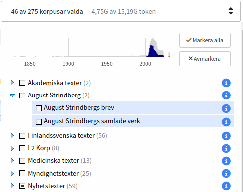
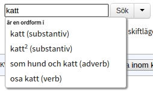
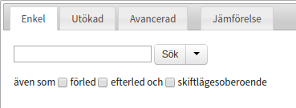
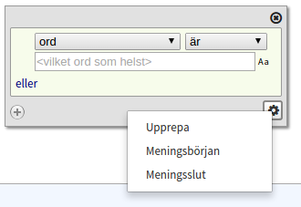
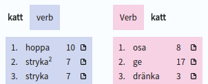

## Introduction

This is a user manual for the corpus search tool  [Korp](http://spraakbanken.gu.se/korp/). Before you continue reading
we recommend that you visit the Korp page and do some test searches in order to get a rough picture of how the interface
works.

There are even some Korp exercises available for download (although only in Swedish)
[here](https://svn.spraakdata.gu.se/repos/lb/trunk/sbkhs/pub/exercises/korp_ovningsuppgifter-hw17.pdf),
[here](https://svn.spraakdata.gu.se/repos/lb/trunk/sbkhs/pub/exercises/korp_ovningsuppgifter.pdf)
and [here](https://svn.spraakdata.gu.se/repos/lb/trunk/sbkhs/pub/exercises/korp_ovningsuppgifter_2012.pdf).

## Different Korps

The material in Korp is divided into different modes. The default mode holds material written in contemporary Swedish
(from the 1900's and newer). On the very top of the page, above the Korp logo, you can find links to the other modes, including older Swedish texts, material in different languages and parallel corpora. The functionality can vary between the different modes and this manual focusses on Korp's default mode.

## The corpus selector

To the right of the Korp logo you can find the *corpus selector* which is used to choose the corpus or corpora you would
like to search in. Some corpora are sorted into different categories. You can select a corpus or a category by ticking
the check box in front of its name. Hovering over a corpus name will give you some information about the corpus such as how many tokens and sentences it contains.

Above the list of corpora there is a time line with bars that will give you an idea on the distribution of the material
over time. The selected corpora are shown as blue bars and the remaining material is shown in gray. Material that does not contain any time information is shown in red to the right of the time line.

## Searching in Korp

The Korp interface is divided into two main sections: the upper section where the search parameters are defined and the
lower section where to search result is shown. The search section has three different versions: *Simple*, *Extended* and
*Advanced*, each of which allows for searches with different degrees of complexity.
The *Simple* tab only allows for searches for words or phrases while *Extended* offers tools for building more complex
queries. Usage of the *Advanced* tab requires some knowledge about the query language used within Korp (CQP).

### Simple search

In a simple search one can choose to search for one or more words, or a *lemgram*. The latter includes all inflected
forms of a word or a multi word expression and thus makes it possible to search for e.g. "katt", "katter" och "katterna"
(different inflections of the Swedish word "cat") in a single query.

In order to perform an ordinary word search you need to enter the word(s) in the search field and hit the search button
(or press Enter on your keyboard). If you wait a little while before hitting the search button a list with suggested
lemgrams matching the entered word will appear. A lemgram search is performed by selecting one of the suggested lemgrams
(by either clicking on it or using the arrow keys and then pressing Enter) and then sending the search query by clicking
the search button or hitting Enter.

Below the search field are a selection of check boxes, giving you a few options for your search.

**In order**  
When searching for more than one word, the default search requires all words to occur in exactly the given order next to each
other. By unchecking the *in order* box, the search will instead find all sentences containing the search words, but the
order does not matter, and they do not need to be next to each other.

**Initial part and final part**  
The check boxes *initial part* and *final part* extend the search to words that include the given word as a prefix
or suffix. In the case of a lemgram search a compound analysis is used to determine the possible results that can have
the chosen word as initial or final part.

**Case-insensitive search**  
There is also a check box for *case-insensitive* search. If it is ticked the result will include both upper-cased and
lower-cased words (i.e. searching for "katt" will also yield hits for "KATT" and "Katt"). This has however no effect on
a lemgram search since lemgram searches are always case-insensitive.

**Related words**  
After performing a lemgram search a button will appear to the very right of the search field which leads to a list of
related words. Clicking on any of the listed words will initiate a new search.

### Extended search

The Extended tag allows you to build more complex queries. Each gray box represents one *token* (which usually is a word
or punctuation) and different criteria can be specified for each token. Press the +-button on the right to add another
token or the x-button in the upper right corner (it is not visible unless at least two tokens are specified) to remove
it. It is possible to change the token order by dragging and dropping.

In order to define search criteria for a token you choose an attribute from the drop-down menu. The default setting is
to search for a word but you can choose to search for part-of-speech, lemgram, etc. instead. Another drop-down menu to
the right allows for negations by changing "is" to "is not". Some attributes even let you choose "begins with",
"contains", "ends with" or you can use regular expressions.

In the text field below the drop-down menus you can specify the value for your chosen attribute. Some attributes (e.g.
part-of-speech) will provide you with yet another drop-down instead of a text field  

I textfältet under skriver man sen in önskat värde för attributet. För vissa attribut finns det i stället för ett
textfält and in some special cases (*lemgram* and *sense*) you will need to pick a value from the list that pops up
after writing in the text field.

The small "Aa"-symbol to the right of the text field lets you switch on and off case-sensitivity  for each token. The
default search is case-sensitive. Please note that sase-insentive searches are considerably slower.

If you choose the attribute "word" and do not enter any value, you will be searching for any token.

For each token it is possible to specify several criteria in the following fashion:
*(A or B or C) and (E or F) and ...*. The brighter area inside the gray box represents a group with *or* criteria.
Press "or" in the bottom right corner to add another one.
To add *and* including a new *or* group press on the +-button in the bottom left corner.

**Repetition, sentence start and sentence end**  
In the bottom right corner of every token box you can find a cogwheel button which provides further search criteria.
The first one, *Repeat* lets you repeat the current token as many times as specified. By specifying a token with
*Any word* and *Repeat 1 to 3 times* you can define a gap in your search query consisting of at least one and at max
three tokens.
The other two criteria in this menu are *Sentence start* and *Sentence end* which define that the current token must be
first or last in the sentence. Remember that punctuation also counts as a token which means that the last token in a
sentence most often is a full stop instead of a word.

**Sök över meningsgränser**  
Som standard utförs alla sökningar *inom* meningsgränserna, vilket betyder att man aldrig kommer att få en
träff som sträcker sig utanför en mening. För vissa korpusar finns det dock möjlighet att i stället tillåta träffar som
spänner över en större mängd text, till exempel ett stycke, vilket gör det möjligt att söka över meningsgränser.

Alternativet för att aktivera detta hittar man precis till höger om Sök-knappen vid Utökad sökning. Om den eller de
korpusar man har valt inte stöder utökad kontext, så kommer det här inte gå att välja något annat än "mening". Har man
däremot valt minst en korpus som tillåter utökad kontext så kommer man kunna välja det i listan. Om bara en del av de
valda korpusarna har detta stöd så kommer det stå något i stil med "upp till stycke". Detta innebär att sökningen kommer
ske inom styckesgränsen *för de korpusar som stöder det*, och största
möjliga kontext som är mindre än ett stycke, för de som inte stöder det, vilket i de flesta fall kommer vara en mening.

**Parallellsökning**  
Vissa av korpusarna i Korp är så kallade parallellkorpusar, som består av två versioner av samma text som är länkade
sinsemellan på meningsnivå. Oftast rör det sig om texter på två olika språk. Sökresultatet från en sådan korpus kommer
bestå av *par* av meningar, en för varje version av texten. För att kunna utföra parallellsökningar måste man först
växla till det parallella läget i Korp, via länken "Parallella" högst upp på sidan.

Parallellsökning går enbart att utföra med Utökad sökning. Detta fungerar till största del som en vanlig sökning,
med skillnaden att man nu har möjlighet att välja vilken eller vilka av språkversionerna man vill söka i. Detta görs i en språkmeny ovanför
första tokenrutan. Det går även att söka parallellt i båda språken genom att trycka på knappen "Fler språk" nere vid Sök-knappen. Detta
lägger till en extra rad med token, i vilken man kan ange sökkriterier för det andra språket. En sökning gjord på detta vis
betyder att dina sökkriterier måste uppfyllas av båda språken i varje meningspar för att en träff ska hittas. Man kan till exempel
med en svensk-engelsk översättningskorpus söka efter länkade par där den svenska delen måste innehålla ordet "älg", medan den engelska
måste innehålla "elk". Man kan också genom att kryssa i rutan "Innehåller inte" säga att man bara vill ha de träffar där
ordet "elk" *inte* förkommer i den engelska delen.

För vissa korpusar finns det utöver meningslänkning även *ordlänkning*. Genom att markera ett ord på ena språket kan man då se vilket
eller vilka ord i andra språket som detta ord motsvarar. Observera att ordlänkningen i regel är automatiskt utförd och därför inte är helt
tillförlitlig.

### Avancerad sökning

Oavsett om man använder Enkel eller Utökad sökning så omvandlas ens fråga till ett uttryck i frågespråket CQP Query Language. På fliken
*Avancerad* kan man både se hur de skapade uttrycken för Enkel och Utökad ser ut, samt konstuera en egen sökfråga om man vill
göra något som är mer avancerat än vad som för närvarande är möjligt i en Utökad sökning.

För att läsa mer om frågespråket, se [CQP Query Language Tutorial](https://cwb.sourceforge.io/files/CQP_Tutorial.pdf).

### Visningsalternativ

Oberoende av vilken version av sökgränssnittet man använder så finns det en rad med *visningsalternativ*, placerade längst ner i en rand
under sökfälten. Här kan man ställa in olika visningsalternativ för sökresultatet. För KWIC:en kan man välja antalet träffar
per sida, samt sorteringsordning. Sorteringen kan ske antingen efter höger- eller vänsterkontext, på själva träffen i sig, eller slumpvis. Sorteringen sker
enbart inom varje korpus. Med standardvalet "förekomst" kommer träffarna visas i den ordning
de förekommer i korpusen, vilket i många fall är en delvis slumpvis ordning av upphovsrättsliga skäl.

För statistiken går det att välja vilket attribut statistiken ska sammanställas på.

Det är även möjligt att inaktivera vissa funktioner i resultatvyn, som t.ex. statistik, om man inte är intresserad av statistik och vill
snabba upp sina sökningar något.

## Sökresultat

Resultatvyn, som visas först efter att en sökning har utförts, är uppdelad i tre olika avdelningar: *KWIC*, *Statistik* och *Ordbild*.

### KWIC

KWIC, som står för "keyword in context", visar det sökta ordet eller orden i sin kontext, vanligtvis en mening. Sökresultaten, om de är många, är
uppdelade på ett antal sidor, och för att bläddra mellan sidorna använder man *‹*- och *›*-knapparna, alternativt tangenterna *f* respektive *n*
på tangentbordet.

Förutsatt att man har sökt i mer än en korpus, kommer det till höger om texten som anger hur många träffar sökningen gav finnas en färgad remsa. Denna
visar med alternerande färger storleksförhållandet mellan träffmängden i de olika korpusarna, och genom att föra musen över dem ser man vilken
korpus varje bit representerar. För att snabbt komma till den träffsida där träffarna från en viss korpus börjar, klickar man på önskad korpus
i denna remsa.

Sökträffarna är grupperade efter korpus, och vilken korpus de efterföljande träffarna kommer från står skrivet med liten rubrik ovanför.

Längst ner på sidan under KWIC-raderna, finns möjligheten att exportera den aktuella sidans träffar i olika format för nedladdning.

**Större kontext**  
I vissa korpusar är det möjligt att få se en större kontext än bara en mening. Vanligtvis rör det sig om hela stycken. För att visa eventuell större
kontext klickar man på länken "Via kontext" till höger om sidbläddraren. Detta växlar till en alternativ träffsida, där större kontext visas i de fall
det är möjligt, och varje träffrad är radbruten för enklare läsning. I övrigt fungerar kontextläget precis som det vanliga KWIC-läget.

**Sidopanelen**  
Genom att klicka på token i KWICen kan man markera ord, och när ett ord har markerats visas till höger en sidopanel. Denna sidopanel
innehåller både information om det markerade ordet (under rubriken *Ordattribut*), och eventuellt också den mening eller större text som ordet ingår i (under *Textattribut*).
Ordattributen är information som ordklass, grundform, sammansättningsanalys med mera, medan textattributen kan vara författare, utgivninsår och liknande.

Vissa attribut är klickbara. Klickar man t.ex. på ett lemgram, så utförs en ny sökning på det lemgrammet. När man för musen över många klickbara attribut
dyker det till höger upp en liten länk som i en ny webbläsarflik tar en till *Karp*, Språkbankens sökgränssnitt för lexikala resurser.

När ett ord är markerat markeras även dess syntaktiska huvud i samma mening, med en ljusröd bakgrund.

### Statistik

Statistik-fliken visar en tabell där varje kolumn motsvarar en korpus, och raderna utgörs av de olika värden som sökningen matchat. Som standard
sammanställs statistiken på ordformer, och vid en enkel
sökning på endast ett ord kommer det därför bara finnas en rad, medan en sökning på ett lemgram i stället ger en rad per ordform som förekommer i materialet.
Bland visningsalternativen kan man välja att sammanställa statistiken på andra attribut än ordform, till exempel ordklass eller något textattribut, samt om
sammanställningen ska vara skiftlägesberoende eller ej.

Genom att klicka på sökträfftexten i en resultatrad i tabellen, öppnas en ny KWIC-flik med de meningar som legat till grund för just den statistikraden.

Tabellens celler visar antalet förekomster i varje korpus, både i absoluta tal (inom parentes) och relativa tal. De relativa talen visar antal träffar per en miljon token.
Genom att klicka på kolumnernas rubriker kan man sortera tabellen i stigande eller fallande ordning efter vald kolumn.

Precis till vänster om totalkolumnen finns det en liten symbol på varje rad, som låter en öppna ett cirkeldiagram där man kan se fördelningen av träffarna
i de olika korpusarna. Här kan man också växla mellan att visa diagram för absoluta eller relativa tal.

Längst ner på sidan, under tabellen, finns möjligheten att exportera statistiktabellen i olika format för nedladdning.

**Trenddiagram**  
Om någon av korpusarna man har sökt i innehåller tidsinformation, är det möjligt att ta fram ett trenddiagram. Trenddiagrammet utgår från rader i statistiktabellen,
och visar förändringen av dessa raders relativa frekvens över tid. Den relativa frekvensen i diagrammet visar antalet träffar per en miljon token för varje specifik tidsenhet.

För att komma till trenddiagrammet väljer man först ut en eller flera rader från statistiken med hjälp av kryssrutorna längst till vänster i tabellen, och därefter klickar man
på knappen *Visa trenddiagram*. En ny flik kommer då öppnas, innehållande ett linjediagram. Diagrammets horisonella axel visar tid, medan den vertikala axeln visar relativ frekvens.
Varje linje i diagrammet motsvarar en vald rad i statistiktabellen, och i teckenförklaringen längst till höger går det att kryssa i och ur vilka linjer man vill visa. Genom att
klicka på en punkt på en linje, öppnas en ny flik med alla träffar för just den tidpunkten.

Under trenddiagrammet finns en miniatyrversion av diagrammet, med handtag som låter en zooma in och panorera runt i det stora diagrammet. Upplösningen på trenddiagrammets tidaxel
bestäms av storleken på det tidsspann som visas, och genom att zooma in går det att visa tidsinformation ner på sekundnivå, förutsatt att det valda materialet har stöd för det.

**Karta**  
Kartfunktionen utgår likt trenddiagrammet från rader i statistiktabellen. Du når den genom att kryssa för en eller flera
rader i statistiken med hjälp av kryssrutorna längst till vänster i tabellen, och därefter klicka på knappen "Visa karta".
I den meny som då fälls ut väljer du vilket attribut du vill basera kartan på. För de flesta korpusar är det endast möjligt
att basera kartan på samförekomst med platsnamn på menings- eller styckesnivå, dvs den tittar på sökträffens kontext och
letar efter platser där. Men för vissa korpusar finns det även platsinformation angiven som metadata, t.ex. en bloggares
hemort, och då är det möjligt att basera kartan på den informationen i stället.

Efter att du gjort ditt val och klickat på "Visa karta"-knappen kommer en ny kartflik öppnas.

### Ordbild

Ordbildsfunktionen är som standard inaktiverad, och måste först aktiveras genom att kryssa i rutan "Visa ordbild" bland sökinställningarna.
Ordbildsfliken är endast aktiv då man från *Enkel* sökning har sökt på ett *ensamt ord* eller ett *lemgram*. Här visas det sökta ordet tillsammans med ord som det har
olika syntaktiska relationer till i materialet, grupperat efter relation. För ett verb visas till exempel de subjekt och objekt som är särskilt utmärkande för just det
verbet, och för ett substantiv visas utmärkande attribut, och verb som substantivet är subjekt och objekt till.

Som standard visas max 15 ord för varje relation, men till höger på sidan finns det inställningsmöjligheter för att visa fler.
Siffran intill varje ord uppger hur många gånger just den relationen finns i det valda materialet. Listorna
är ordnade efter ett Lexicographer's Mutual Information-värde.

Genom att klicka på den lilla ikonen intill varje ord kan man få fram en ny KWIC-flik med alla de meningar i vilka vald relation förekommer.

## Jämförelser

Det är möjligt att göra en log-likelihood-jämförelse av resultatet från två sökningar. För att göra en sådan jämförelse behöver man först spara två sökningar.
Detta gör man från valfri sökflik, genom att först skapa sitt sökuttryck, och sen klicka på pilen till höger om Sök-knappen. Detta låter en spara själva sökningen med ett valfritt namn,
i stället för att utföra den. När man har två sökningar sparade kan man gå till fliken *Jämförelse*, som ligger till höger om de tre sökflikarna.
Här väljer man de två sökningar man vill jämföra, och därefter vilket attribut som jämförelsen ska utföras på. Ett exempel på en jämförelse är de två sökningarna
*alla substantiv i romaner* och *alla substantiv i nyhetstexter*, med sammanställning på *grundform*. När denna jämförelse är klar presenteras två kolumner med grundformer:
den första listar de grundformer som är mest utmärkande för sökning #1, och den andra listar grundformer utmärkande för sökning #2. Kolumnerna är sorterade med de mest
urmärkande orden överst. Siffrorna till höger visar absolut frekvens.
